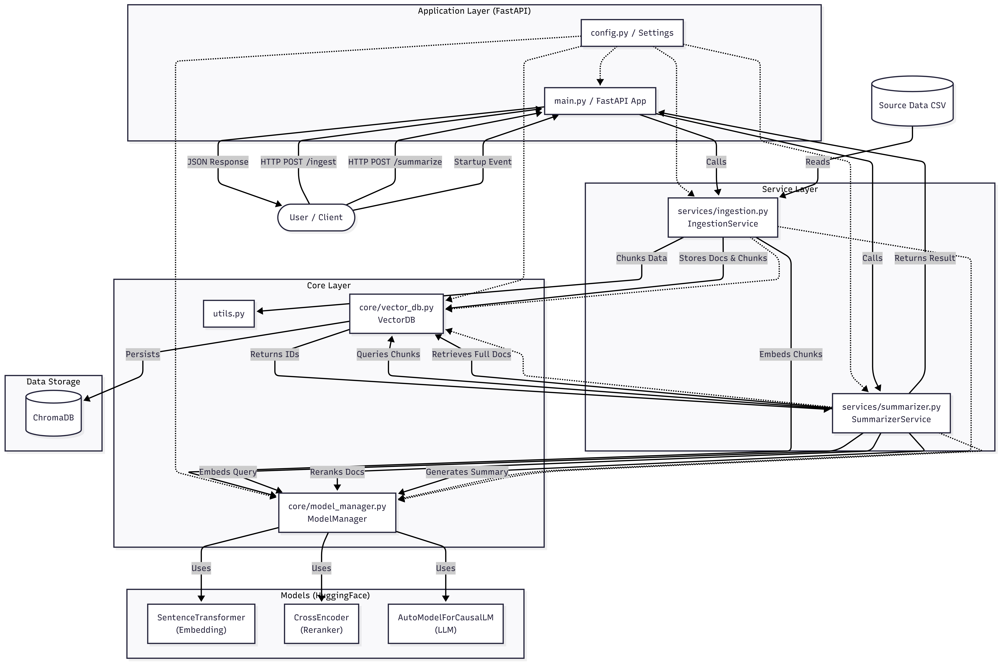

# Summary
This is an attempt to build an AI ~Agent~ **Chatbot** that will read Jira ticket descriptions for new tickets and summarize the contents in a neat and concise way based on Jira data ingested in the past

# Tech Stack
- Python3
- FastAPI (with uvicorn)
- sentence-transformers (with MiniLM for embedding and Qwen2.5 LM for Instruct purposes)
- pandas
- pyarrow
- ChromaDB
- tiktoken
- ReactJS for frontend
- Babel for JSX

# Overall Architecture / Data Flow Visualization
Thanks to [Mermaid.AI](https://mermaid.ai/d/7c698629-39e6-446f-bb39-2725ee697de4), you can visualize the overall Architecture and Component Interaction Diagram
. 

# Data Setup
This agent needs external data sources to build the knowledge base required to augment the responses from the LM. Currently, two publicly accessible data sources were tried from Kaggle

- [Apache JIRA Issues](https://www.kaggle.com/datasets/tedlozzo/apaches-jira-issues?select=issues.csv)
- [Jira Dataset](https://www.kaggle.com/datasets/cesaranasco/jira-dataset)

whichever dataset is used, the expectation here is that it's a CSV file with column names configured in the [config.py](config.py#L20) file

# How to Run?
1. Install python3
2. Clone this git repo
3. Navigate to the root of the repo and run `source .jts/bin/activate` to activate/switch to this virtual environment
4. Run `pip install -r requirements.txt` to setup the required dependencies. You may have to upgrade pip if you get an `AssertionError`
5. Download the data sources mentioned in the previous section and unzip to the source-data directory
6. Run `uvicorn main:app` to ingest sample data and spin up the FastAPI server

Once the ingestion completes, the app is ready with a [GUI](http://localhost:8000/ui/index.html) providing 

# Sample Test

## Ingest a new document

Run the [ingest](test-scripts/ingest.py) script

## Summarize a query

Run the [summarize](test-scripts/summarize.py) script

# TODOs
1. [Done] - ~~Build a basic GUI for user to submit their queries and view the responses returned~~
2. [Done] - ~~Provide an option to user to retrieve top-k results. The default is 3 now~~
3. [**WIP**] - Provide an endpoint to ingest one or more documents or reingest one or more datasources on demand
4. [Done] - ~~Move the local LM name, dataset location, CSV column names to a configuration file~~
5. [**WIP**] - Model Fine/Prompt-tuning
6. [Done] - ~~Configure ChromaDB to use hnsw indexing~~

# Future Enhancements

1. Provide options to switch to a cloud-model accepting necessary configs like URL, Auth Token/API Key, etc
2. Provide an endpoint to save/load pre-trained models on demand
3. Model Quantization
4. Introduce a Agent Routing layer to route processing to appropriate tool/agent based on the request
